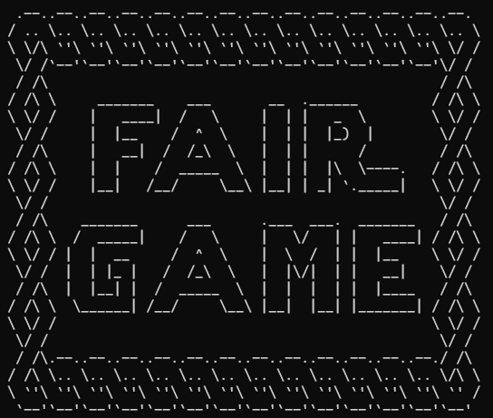
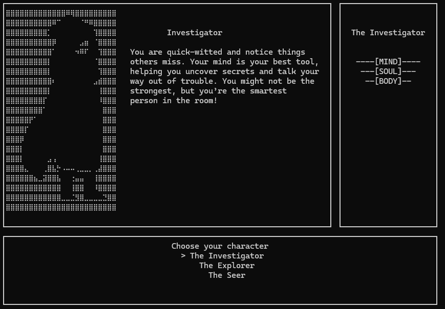
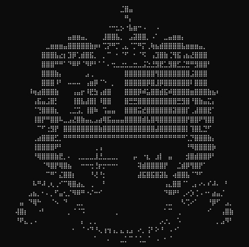

# Fair Game

<p align="center">
	<b>Fair Game </b><br>
	<i>A magical, child-friendly, witchy narrative adventure made in Python for Weans Game Jam: Summer 2025</i>
</p>

---

<p align="center">
	<!-- PLACEHOLDER: Add screenshots or animated GIFs of the game here -->
	
	
    
    
	<br>
	
</p>

---

## 🎮 Play the Game

👉 <b>[Download the game here!](https://mama666.itch.io/fair-game)</b> 👈

---

## About the Project

This project was created in a week for the <b>[Weans Game Jam Summer 2025](https://itch.io/jam/-the-weans-game-jam-summer-2025-edition)</b> with the theme: *What matters to me*. It is a whimsical, narrative-driven, text-based soft RPG designed for children, inspired by Bo'ness folklore and their Fair Day tradition.

**Key Features:**
- Modular Python CLI framework with beautiful ASCII art and sound.
- Branching dialogue, simple skill checks, and a magical, non-violent story.
- Dynamic soundtrack and customizable art for every action, spell, and effect.
- Designed for easy extensibility and future graphical upgrades.

### 🌸 What’s It About?
You’re a wee wanderer who arrives in Bo’ness just before Fair Day, the best day of the year! But something’s wrong… with the Queen! Whispers in the night hint at a big secret. With help from the Witches of Bo’ness, you’ll uncover the truth and save the town before the crown is stolen!

### 💖 Why I Made It?

What matters to me? My feelings and the people I love.
Cler is someone who matters to me. They’re from Bo’ness, and Bo’ness matters to them.
And what matters to Bo’ness? The Fair Day! That’s what inspired this whole game.
I made Fair Game in just one week, so there were lots of things I didn’t have time to add or polish. But I hope it still feels magical and kind.

---

## Project Structure & Framework

- <b>CLI-based, modular screen system:</b> Each scene (title, intro, chapters, ending) is a class in <code>screens/</code>, all inheriting from <code>BaseScreen</code> for consistent UI and centering.
- <b>Main loop:</b> <code>main.py</code> wraps the game in a <code>while True</code> loop, allowing replay from the title screen after the end screen. No direct calls to <code>main()</code> from screens.
- <b>UI Template:</b> All scenes use a shared template: main rectangle (art), side box (menu/info), and text box (dialogue/choices).
- <b>Art & Sound:</b> ASCII art is loaded dynamically from <code>assets/art/</code> and music from <code>assets/audio/</code>. Art and music mappings are fully customizable per action, spell, and effect.
- <b>SoundManager:</b> Handles background music and sound effects using pygame, with seamless transitions between tracks.
- <b>Utilities:</b> Shared helpers (art loading, ArrowMenu, skill checks) are in <code>screens/utils.py</code>.
- <b>Extensible:</b> Easy to add new scenes, dialogue, or mechanics. Designed for future graphical/point-and-click upgrades.

```
weans-game-jam-2025/
│
├── main.py                # Main game loop and entry point
├── assets/
│   ├── art/               # ASCII art files
│   └── audio/             # Music and sound files
├── screens/               # All scene and UI logic
│   ├── base_screen.py     # Base class for all screens
│   ├── utils.py           # Shared helpers (art loading, ArrowMenu, skill checks)
│   ├── ...                # TitleScreen, IntroSceneUI, CharChoiceScene, etc.
├── sound_manager.py       # Handles music and SFX
├── texts/
│   ├── story(kids).md     # Game story and script
│   └── progress.md        # Devlog and progress tracker
└── README.md              # This file
```

**Development Environment & Packaging:**
- The project uses a Python virtual environment (`.venv`) for dependency management and isolation.
- Main external packages used:
    - `pygame` (for music and sound effects)
    - `os`, `threading`, `random`, `time` (Python standard library)
- The game was exported as a standalone executable using [PyInstaller](https://pyinstaller.org/), bundling all assets and dependencies for easy distribution.

---

## Game Design & Mechanics

- **Platform & Style**
    - Python project, CLI-based, with ASCII art encouraged.
    - Modular screen system: each scene is a class in screens, inheriting from BaseScreen.
    - Main UI: main rectangle (art), side box (menu/info), and text box (dialogue/choices).
    - Art and music mappings are fully customizable: any filename can be used for any effect, as long as the mapping and asset exist.
    - SoundManager handles music and SFX using pygame.

- **Narrative & Mechanics**
    - Narrative-driven with branching dialogue choices and simple skill checks (coin tosses, stat checks).
    - Player stats: Mind, Soul, Body. No complex combat; focus on choices, exploration, and story.
    - Dialogue menus for player choices, with class-based branching (e.g., Seer gets unique dialogue, Explorer/Investigator get menu-driven choices).
    - Skill checks determine scene outcomes and branching.
    - All scenes use a consistent UI.
    - In the battle system, the "Analyze Weakness" buff applies to the next attack of any type (class action or spell), not just Tackle.
    - All battle effect and action text appears in the normal text box area, preserving the main art and side menu UI.
    - Battle scenes support dynamic effect art for all actions, spells, and champion moves. Art for menu selection and for effect resolution can be different and is controlled by mapping dictionaries in the scene code.
    - The end screen is modular: ENTER restarts the game (returns to main loop), ESC exits. No direct calls to main() from screens.


---

## Progress & Devlog

- The game was developed in rapid, modular iterations. Major milestones include:
	- Dynamic soundtrack and effect art for all actions, spells, and champion moves.
	- Modular, replayable main loop and robust end screen logic.
	- Consistent, child-appropriate writing and whimsical tone throughout.
- For a detailed changelog and devlog, see <b>[texts/progress.md](texts/progress.md)</b>.

---

## Things I Wish I Had Time For

- More detailed ASCII art and animations.
- Minigames (lock-picking, maze navigation, broom flying).
- More RPG-like UI for fights.
- Deeper dialogue branching and class-specific outcomes.
- More sound design, SFX, and music planning/mixing.

---

## Credits

- Game design, code, and writing: <b>mama</b>
- Inspiration, testing, and support: <b>Cler</b>
- Created for <b>Weans Game Jam Summer 2025</b>
- Music used:
    - Fair Day Songs: Our Festal Day, Hail to our Queen, This Is The Best Day Of The Year https://www.thefairday.com/the-fair-songs/
    - Kinneil Band Songs: Kinneil Colliery, Journey Home https://www.kinneilband.co.uk

---
